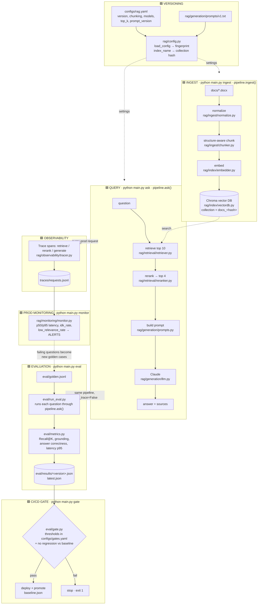
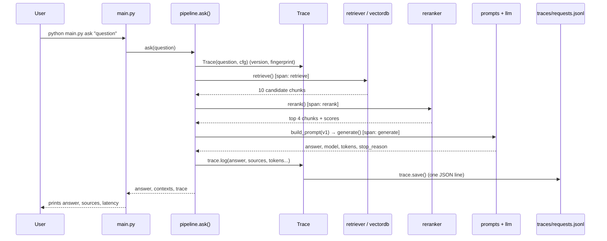
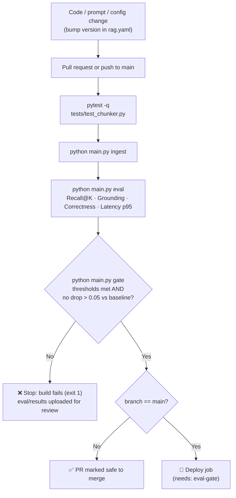

# Application Flow Diagram

The diagrams use Mermaid. They render in GitHub and in PyCharm's Markdown preview
(enable Mermaid under Settings → Languages & Frameworks → Markdown if needed).
A plain-text version follows each diagram.

Legend: 🟦 RAG pipeline · 🟩 LLMOps (versioning, eval, gate, observability, monitoring)

---

## 1. The whole system



<details>
<summary>Plain-text version</summary>

```
                 ┌──────────────── VERSIONING ────────────────┐
                 │ configs/rag.yaml + prompts/v1.txt          │
                 │   → rag/config.py: fingerprint, index hash │
                 └─────────────────────┬──────────────────────┘
                                       │ settings
       ┌───────────────────────────────┴─────────────────────────────┐
       ▼                                                             ▼
 INGEST (main.py ingest)                                  QUERY (main.py ask)
 docs/*.docx                                              question
   → normalize.py                                           → retrieve top 10 ◄──┐
   → chunker.py (structure-aware)                           → rerank → top 4     │
   → embedder.py                                            → build prompt (v1)  │
   → Chroma (docs_<hash>) ─────────── search ───────────────→ Claude             │
                                                             → answer + sources   │
                                                                   │              │
                                              every prod request   ▼              │
                                   OBSERVABILITY: tracer.py → traces/requests.jsonl
                                                                   │              │
                                   MONITORING: monitor.py → p95, idk_rate, alerts │
                                                                   │              │
                                        failing questions ─────────┘              │
                                                ▼                                 │
                        EVALUATION: golden.jsonl → run_eval.py ── same ask() ─────┘
                                     → metrics.py → eval/results/<version>.json
                                                ▼
                        CI/CD GATE: gate.py + gates.yaml
                                     pass → deploy + promote baseline
                                     fail → stop (exit 1)
```
</details>

---

## 2. Query flow in detail (who calls what)

`main.py` is only the entry point. `rag/pipeline.py → ask()` orchestrates the steps.



<details>
<summary>Plain-text version</summary>

```
main.py ask
  └─ pipeline.ask()                                     rag/pipeline.py:25
       ├─ Trace(question, cfg)                          rag/observability/tracer.py:17
       ├─ [span retrieve] retrieve() → vectordb.search() → 10 chunks     line 30
       ├─ [span rerank]   rerank() → top 4                               line 32
       ├─ [span generate] build_prompt(v1) → generate() → Claude         line 34-35
       ├─ trace.log(answer, sources, tokens, stop_reason)                line 37
       └─ trace.save() → traces/requests.jsonl                           line 46
```
</details>

---

## 3. CI/CD gate flow



Defined in `.github/workflows/rag-ci.yml`.

---

## 4. LLMOps in the code

| LLMOps area | Where in the code | What it does |
|---|---|---|
| Versioning: config | `configs/rag.yaml:3` (`version`), `:27` (`prompt_version`) | Every quality setting lives in one versioned file |
| Versioning: prompt | `rag/generation/prompts/v1.txt`, `rag/generation/prompts.py:7` | A prompt is a file; switch versions in the config |
| Versioning: fingerprint | `rag/config.py:11-17` | Hash of config + prompt text identifies the exact setup |
| Versioning: index | `rag/config.py:20-27`, `rag/index/vectordb.py:8` | New Chroma collection when chunking or embedding changes |
| Evaluation: dataset | `eval/golden.jsonl` | 14 questions with expected sections and facts |
| Evaluation: metrics | `eval/metrics.py:8` Recall@K, `:17` grounding, `:31` correctness | Deterministic scores, no LLM judge |
| Evaluation: runner | `eval/run_eval.py:19`, results at `:51` | Scores are saved per version |
| CI/CD gate: thresholds | `configs/gates.yaml` | Minimums, latency max, allowed regression |
| CI/CD gate: logic | `eval/gate.py:16` check, `:37` promote | Pass/fail + baseline comparison |
| CI/CD gate: pipeline | `.github/workflows/rag-ci.yml:29-33`, `:41` | ingest → eval → gate → deploy only on pass |
| Observability: tracer | `rag/observability/tracer.py:17-44` | Spans, fields, one JSON line per request |
| Observability: usage | `rag/pipeline.py:30-46` | Times each stage; logs sources, tokens, model |
| Prod monitoring | `rag/monitoring/monitor.py:11` alerts, `:23` summarize | p50/p95, idk rate, low-relevance rate, alerts |

A detailed explanation of each area is in `configs/llmops_implementation.txt`.

---

## 5. External references for learning LLMOps

**Foundations**
- Google Cloud: *MLOps: Continuous delivery and automation pipelines in machine learning*. The maturity levels (manual → CI/CD → continuous training) that LLMOps builds on.
  https://cloud.google.com/architecture/mlops-continuous-delivery-and-automation-pipelines-in-machine-learning
- Chip Huyen: *Building LLM applications for production*. Covers prompt versioning, evaluation, cost and latency.
  https://huyenchip.com/2023/04/11/llm-engineering.html
- Eugene Yan: *Patterns for Building LLM-based Systems & Products*. Covers evals, RAG, guardrails and collecting feedback.
  https://eugeneyan.com/writing/llm-patterns/

**RAG**
- Lewis et al. (2020): *Retrieval-Augmented Generation for Knowledge-Intensive NLP Tasks*, the original RAG paper.
  https://arxiv.org/abs/2005.11401
- Sentence-Transformers: embeddings and cross-encoder reranking, as used in `embedder.py` and `reranker.py`.
  https://www.sbert.net/ · https://sbert.net/examples/cross_encoder/applications/README.html
- Chroma: the vector DB used in `vectordb.py`.
  https://docs.trychroma.com/

**Evaluation**
- Anthropic / Claude docs: *Create strong empirical evaluations*. How to design test cases and grading.
  https://docs.claude.com/en/docs/test-and-evaluate/develop-tests
- Ragas: RAG metrics (faithfulness, context recall, answer relevancy). A natural upgrade from `eval/metrics.py`.
  https://docs.ragas.io/

**Observability and monitoring**
- Langfuse: open-source LLM tracing, prompt management and evals. The next step after `traces/requests.jsonl`.
  https://langfuse.com/docs
- Arize Phoenix: open-source LLM/RAG tracing and evaluation.
  https://arize.com/docs/phoenix
- OpenTelemetry semantic conventions for GenAI: the standard field names for LLM spans.
  https://opentelemetry.io/docs/specs/semconv/gen-ai/

**Diagram syntax**
- Mermaid, if you want to edit these diagrams: https://mermaid.js.org/
